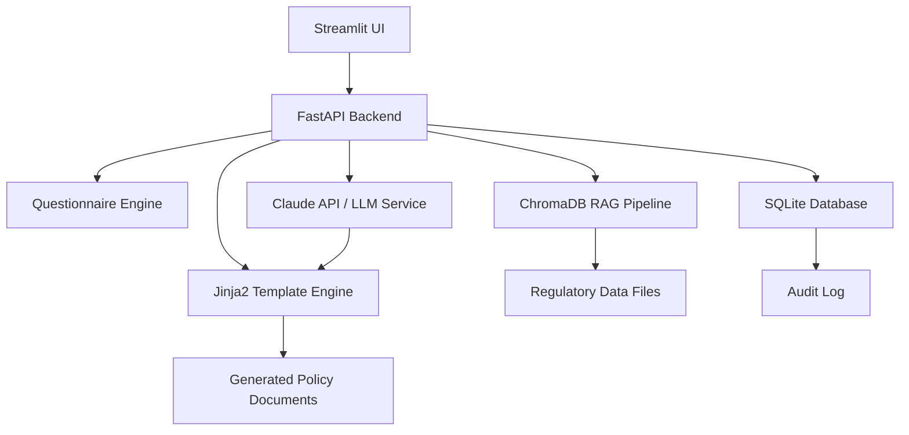

# AI Compliance Policy Generator for Australian SMEs

Generate customised, regulation-aligned AI governance policy documents for Australian small and medium enterprises.

## What It Does

Produces three tailored policy documents through a guided questionnaire:

1. **AI Acceptable Use Policy** - Approved/prohibited AI uses, data handling, human oversight
2. **Data Classification for AI** - Classification tiers and rules for AI data input
3. **AI Incident Response Plan** - Detection, containment, OAIC notification, recovery procedures

## Architecture



**Key components:**
- **Questionnaire** — 10 questions capturing org profile, AI usage, data types, governance
- **Template Engine** — Jinja2 templates with conditional sections based on answers
- **RAG Pipeline** — ChromaDB indexes Australian regulatory text for grounded LLM responses
- **Claude API** — Generates customised regulatory alignment notes (optional, requires API key)
- **Compliance Scorecard** — Checks org against 8-point regulatory checklist
- **Audit Trail** — Append-only log with SHA-256 document hashing

## Regulatory Alignment

- Privacy Act 1988 & Australian Privacy Principles (APPs)
- Australia's 8 AI Ethics Principles
- OAIC guidance on AI and privacy
- Notifiable Data Breaches (NDB) scheme
- AI6 essential governance practices

## Setup

### Prerequisites
- Python 3.11+
- (Optional) Anthropic API key for LLM-enhanced generation

### Install

```bash
cd "cyber project - c"
pip install -r requirements.txt
cp .env.example .env
# Edit .env to add your ANTHROPIC_API_KEY (optional)
```

### Run FastAPI Backend

```bash
uvicorn app.main:app --reload
```

API available at http://localhost:8000. Docs at http://localhost:8000/docs.

### Run Streamlit Dashboard

```bash
cd streamlit_app
streamlit run app.py
```

Dashboard at http://localhost:8501.

### Run with Docker

```bash
docker-compose up --build
```

- Backend: http://localhost:8000
- Streamlit: http://localhost:8501

### Run Tests

```bash
pytest tests/ -v
```

## API Endpoints

| Method | Endpoint | Description |
|--------|----------|-------------|
| GET | `/api/questions` | List questionnaire questions |
| POST | `/api/questionnaire` | Submit questionnaire answers |
| GET | `/api/organisation/{id}` | Get organisation details |
| POST | `/api/generate/{type}` | Generate policy document |
| GET | `/api/policies/{org_id}` | List generated policies |
| GET | `/api/download/{id}` | Download policy file |
| GET | `/api/audit-log` | View audit trail |

## Project Structure

```
app/                    # FastAPI backend
  config.py             # Pydantic settings
  database.py           # SQLite + SQLAlchemy
  models.py             # Organisation, PolicyDocument, AuditLog
  questionnaire.py      # Questions, validation, Pydantic models
  generator.py          # Jinja2 + docxtpl document generation
  llm_service.py        # Claude API integration
  rag_service.py        # ChromaDB RAG pipeline
  compliance_checker.py # 8-point compliance scorecard
  audit.py              # Append-only audit logging
templates/jinja2/       # Jinja2 policy templates
regulatory_data/        # Australian regulatory reference docs
streamlit_app/          # Streamlit multi-page dashboard
tests/                  # pytest test suite
```
